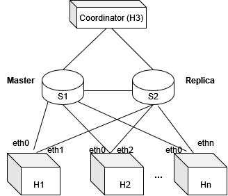

# Implementing Switch Fault Tolerance
# Experiments for RESIST

## Introduction

This program aims to make switches fault-tolerant
with an asynchronous replication technique. We are going to use a simple topology of
two switches (a master and a replica) to exemplify the functionality of the system.

#1 How to run:

Download the VM with bmv2

Use the script run.py to run an experiment by passing the number of hosts as a parameter.

The current experiments consider the following topology:

This implementation uses a single coordinator at 

> scoordinatorAdress = "10.0.3.3"

In case of failures, the coordinator will be used to aggregate shim-layer information from all the hosts. 

We consider N hosts with two interfaces. By default, the interface h0 forwards packets to the replica, while hN is used to forward packets to the replica. 

#requirements

Install the requirements with sudo to make sure you can access from the hosts.

Finally you can run the experiments with: 
> python3 run.py <size>

This experiment will make all the packets after round>=3 to be dropped but delivered to the servers. This is using a configuration inside the switch.

This is made by dropping packet 2, making the replica to wait for it and keep sending packets back to the master.

Next step is to simulate a failure. For that

1.Open the main switch CLI

>> bm_CLI

After that, wait until all the packets traverse the main switch (you can check the round number register)

2. Set the failure register to 1

>> register_write simulateFailure 0 1

3. Check both switches round number 

>> bm_CLI --thrift-port 9091
>> bm_CLI 

register_read roundNumber

Both rounds should be equal after restoring

